# SQL Interview Master Notes

> A complete, interview-ready transcription of my OneNote **SQL** section (10 pages, text + 229 embedded images), reorganized by topic.
> Source notebook: *technical subjects → SQL*. Generated 2026-05-31.

**How to use this file**
- Code screenshots from the notebook are transcribed into runnable ```sql``` blocks; comparison tables into Markdown tables; genuine diagrams are transcribed *and* embedded from [`assets/`](assets/).
- ⚠️ blocks flag factual errors/typos found in the original notes, with the correction.
- Dialect note: many queries were written/tested in **MS SQL Server / MySQL** interchangeably. Where syntax differs (e.g. `TOP` vs `LIMIT`), it's flagged.

## Table of Contents
1. [SQL Querying Fundamentals](#1-sql-querying-fundamentals)
2. [Window Functions](#2-window-functions)
3. [SQL Coding Patterns (interview problems)](#3-sql-coding-patterns-interview-problems)
4. [Functions & Keywords Reference](#4-functions--keywords-reference)
5. [Indexing & Query Optimization](#5-indexing--query-optimization)
6. [DBMS Theory](#6-dbms-theory)
7. [Advanced / DB System Design](#7-advanced--db-system-design)
8. [SQL Nuggets & Gotchas](#8-sql-nuggets--gotchas)
9. [Appendix: Corrections & Diagram Index](#9-appendix-corrections--diagram-index)

---

## 1. SQL Querying Fundamentals

### 1.1 Logical Execution Order
The order SQL *logically* evaluates a query (not the written order):

1. **FROM** — Identifies the source table(s).
2. **JOIN** — Combines tables (if applicable).
3. **WHERE** — Filters rows before aggregation.
4. **GROUP BY** — Groups rows for aggregation.
5. **HAVING** — Filters aggregated results.
6. **SELECT** — Selects columns and applies expressions.
7. **DISTINCT** — Removes duplicate rows.
8. **ORDER BY** — Sorts the result set.
9. **LIMIT** — Restricts the number of rows returned.

> Key consequence: **window functions run after GROUP BY/aggregates but before `SELECT`/`DISTINCT`/`ORDER BY`** — which is why a window function can reference an aggregate without being in `GROUP BY`.

### 1.2 Types of Join
- **INNER** — Only rows with matching values in both tables.
- **OUTER** — All rows from one table + matching rows from the other.
- **LEFT** — All left rows + matching right rows (inner join + non-matching left records).
- **RIGHT** — All right rows + matching left rows.
- **FULL OUTER** — All rows when there is a match in either table.
- **Non-Equi Join** — Join condition is not `=`; uses `<, >, <=, >=, BETWEEN`. Common for ranges (salary slabs, grades, date ranges).
- **CROSS** — Cartesian product (all row combinations).
- **SELF JOIN** — A table joined with itself (technique, not a type). Used for hierarchical / employee–manager comparisons.

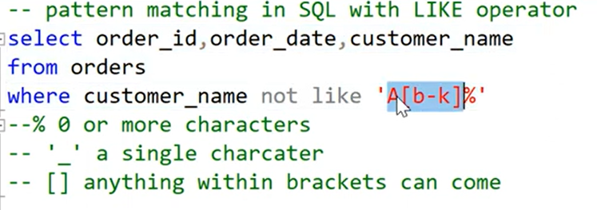

#### Join behaviour with duplicate keys (classic interview)
Given `t1.id1` and `t2.id2` with duplicate and NULL values, the row counts differ per join type. With t1 = {1×6, 2, 4, NULL} and t2 = {1×6, 2, 3, NULL}:
- **INNER / LEFT / RIGHT / FULL** produce different counts.
- Matching `1`s multiply: 6 rows × 1 value pattern... the `1`s produce `3*2 + 2*2 + 1 + 1 + 1 + 1` style fan-out.
- **NULLs never match NULLs** — they can't be compared, so they are never joined on. They only appear as the unmatched side in LEFT/RIGHT/FULL.

> **Rule:** If all records have the same value, all 4 joins return the same result.

### 1.3 WHERE vs HAVING

| Aspect | WHERE | HAVING |
|---|---|---|
| Stage of filtering | Filters rows **before** grouping | Filters groups **after** grouping |
| Aggregate functions | Cannot use them | Can use them |
| Usage | `SELECT`, `UPDATE`, `DELETE` | Only `SELECT` with `GROUP BY` |
| Performance | Faster — reduces rows early | Slower — works on grouped data |

> `HAVING` cannot be used with `UPDATE` (it operates on grouped data; `UPDATE` works on rows). To update based on aggregates, put `HAVING` in a subquery.

```sql
SELECT department, COUNT(*) AS emp_count
FROM employees
WHERE status = 'active'
GROUP BY department
HAVING COUNT(*) > 5;
```

### 1.4 CTE vs Subquery

| Aspect | CTE | Subquery |
|---|---|---|
| Readability | More readable & modular | Less readable, especially nested |
| Reusability | Reusable within the same query | Not reusable; must be rewritten |
| Performance | Similar in most cases | Depends on optimization |
| Recursion | Supports recursion | Does not |
| Use case | Complex/hierarchical queries | Simple to moderate queries |

> Filtering inside a CTE first usually does **not** speed things up — modern optimizers inline CTEs and often produce an identical execution plan.

### 1.5 ON vs WHERE while joining (anti-join decision tree)
**Filtering happens on the table first, then the join.** A condition in `ON` filters the right table *before* matching (left rows preserved). The same condition in `WHERE` filters *after* the join — turning a `LEFT JOIN` into an effective `INNER JOIN`.

```sql
-- Condition in ON: all A rows kept; B pre-filtered (NULLs where no active B)
SELECT * FROM A LEFT JOIN B ON A.id = B.id AND B.status = 'active';

-- Condition in WHERE: NULL B rows removed → behaves like INNER JOIN
SELECT * FROM A LEFT JOIN B ON A.id = B.id WHERE B.status = 'active';
```

**When you MUST use extra conditions in `ON`:**
- **Anti-join / "did NOT have any…"** (no orders, never logged in, without transactions):
  ```sql
  -- ✅ CORRECT
  SELECT * FROM users u
  LEFT JOIN orders o ON u.id = o.user_id AND o.order_date >= '2021-01-01'
  WHERE o.id IS NULL;
  -- ❌ WRONG: putting o.order_date in WHERE kills NULLs → becomes INNER JOIN
  ```
- **Partial existence** ("users with no *failed* payments"):
  ```sql
  SELECT * FROM users u
  LEFT JOIN payments p ON u.id = p.user_id AND p.status = 'FAILED'
  WHERE p.user_id IS NULL;
  ```

**When NOT to** (positive existence — "users who purchased in 2021"): use `INNER JOIN` + `WHERE`.

| Requirement | Put condition in |
|---|---|
| Did not have X / No records of X / Never occurred | **ON** |
| Has records / Filter final rows | **WHERE** |

> One-liner to say in interviews: *"When checking non-existence, I push filters into the `ON` clause so NULLs are preserved."*

### 1.6 Correlated vs Independent Subqueries
- **Independent subquery** — Can run on its own; executes **once**.
- **Correlated subquery** — References the outer query; runs **once per outer row** (slower).

```sql
-- Independent (join to a pre-aggregated derived table) — preferred
SELECT e.*, d.avg_dep_salary
FROM employee e
INNER JOIN (
    SELECT dept_id, AVG(salary) AS avg_dep_salary
    FROM employee GROUP BY dept_id
) d ON e.dept_id = d.dept_id
WHERE e.salary > d.avg_dep_salary;

-- Correlated (runs per row)
SELECT *
FROM employee e1
WHERE salary > (SELECT AVG(e2.salary) FROM employee e2 WHERE e1.dept_id = e2.dept_id);
```

> *"99% of the time you can solve a problem with an independent query + CTE + window functions. Correlated subqueries don't perform well — avoid them."*

### 1.7 Pattern Matching (`LIKE`)
```sql
SELECT order_id, order_date, customer_name
FROM orders
WHERE customer_name NOT LIKE 'A[b-k]%';
```
- `%` → 0 or more characters
- `_` → exactly one character
- `[]` → any one character within the brackets *(SQL Server syntax; MySQL uses `REGEXP` for character classes)*

---

## 2. Window Functions

### 2.1 Ranking: RANK / DENSE_RANK / ROW_NUMBER
```sql
SELECT *,
       RANK()       OVER (ORDER BY salary DESC) AS rn,
       DENSE_RANK() OVER (ORDER BY salary DESC) AS dense_rn,
       ROW_NUMBER() OVER (ORDER BY salary DESC) AS row_num_rn
FROM emp;
```
- **RANK** — ties share a rank, then **skips** (1,1,3…).
- **DENSE_RANK** — ties share a rank, **no skip** (1,1,2…).
- **ROW_NUMBER** — always unique sequential (1,2,3…), ties broken arbitrarily.
- Add a **tie-breaker** in `ORDER BY` (e.g. `salary DESC, emp_age DESC`) to make ranks deterministic.
- Works with `PARTITION BY` (per-department), and multi-column partitions (`PARTITION BY department_id, manager_id`).

### 2.2 LAG / LEAD / OFFSET
- `LAG(col, n, default)` / `LEAD(col, n, default)` — previous / next row's value.
- The optional **3rd arg = default**, so instead of a `CASE` for NULLs at the edges, give a default (e.g. a date): `LEAD(order_date, 1, '2021-01-01')`.
- **OFFSET … FETCH/LIMIT** skips rows:
  ```sql
  SELECT salary FROM Employees ORDER BY salary DESC OFFSET 1 LIMIT 1;  -- 2nd highest
  ```

### 2.3 Frames: ROWS vs RANGE
- **ROWS** — operates on a fixed number of physical rows relative to the current row. Example rolling sum on 10,20,20 → 10, 30, 50.
- **RANGE** — operates on a range of *values* (rows with equal ORDER BY values are treated together). Example: 10 → 10+20+20 if all share the value range.

Frame keywords:
- `UNBOUNDED PRECEDING` — start at the first row of the partition.
- `CURRENT ROW` — the row being computed.
- `UNBOUNDED FOLLOWING` — the last row of the partition.

Default frame (when ORDER BY is present) is `RANGE BETWEEN UNBOUNDED PRECEDING AND CURRENT ROW`.

```sql
-- Running total
SELECT *, SUM(cost) OVER (ORDER BY cost ASC
       ROWS BETWEEN UNBOUNDED PRECEDING AND CURRENT ROW) FROM products;

-- Preceding & succeeding (prev + current + next)
SELECT id, value,
       SUM(value) OVER (ORDER BY id ROWS BETWEEN 1 PRECEDING AND 1 FOLLOWING) FROM data;

-- Make SUM behave like LAG(value,1): pin frame to exactly the previous row
SELECT *, SUM(value) OVER (ORDER BY id ROWS BETWEEN 1 PRECEDING AND 1 PRECEDING) AS prev FROM data;
```

> **Duplicate-ordering pitfall:** `SUM() OVER (ORDER BY cost)` with duplicate `cost` values gives wrong running totals because tied rows share a frame. Fix: add a unique tie-break key, e.g. `ORDER BY cost ASC, product_id`, **or** use an explicit `ROWS` frame.

### 2.4 FIRST_VALUE / LAST_VALUE pitfall
`LAST_VALUE` looks wrong by default because the default frame ends at `CURRENT ROW` — so each row's "last value" is itself.

```sql
-- ✅ See the true last value of the whole partition
LAST_VALUE(coupon_code) OVER (
    PARTITION BY customer_id ORDER BY order_date
    ROWS BETWEEN UNBOUNDED PRECEDING AND UNBOUNDED FOLLOWING)
-- or
LAST_VALUE(emp_name) OVER (ORDER BY emp_age
    ROWS BETWEEN CURRENT ROW AND UNBOUNDED FOLLOWING)
```

### 2.5 NTILE (bucketing)
Divides an ordered result set into N groups/buckets; each row gets a group number.
- 16 customers, `NTILE(4)` → 4 buckets of 4.
- 17 → first bucket gets 1 extra; 18 → first two buckets each get 1 extra.
```sql
WITH cte AS (
    SELECT TOP 18 customer_name, SUM(sales) AS total_sales
    FROM orders GROUP BY customer_name ORDER BY total_sales DESC
)
SELECT *, NTILE(4) OVER (ORDER BY total_sales DESC) AS cust_groups FROM cte;
```

### 2.6 Restrictions
- **`DISTINCT` is not supported inside window functions** in most SQL versions.

---

## 3. SQL Coding Patterns (interview problems)

### 3.1 Students who are NEITHER max NOR min score
Exclude any student who was *ever* a max or min in any exam.
```sql
-- M1: window MAX/MIN per exam
WITH cte AS (
    SELECT e.student_id, student_name, score,
           MAX(score) OVER (PARTITION BY exam_id) AS maxi,
           MIN(score) OVER (PARTITION BY exam_id) AS mini
    FROM Exam e LEFT JOIN Student s ON e.student_id = s.student_id
),
cte2 AS (SELECT * FROM cte WHERE score = maxi OR score = mini)
SELECT DISTINCT student_id, student_name
FROM cte WHERE student_id NOT IN (SELECT student_id FROM cte2);

-- M2: RANK asc & desc; keep students who never ranked #1 either way
WITH T AS (
    SELECT student_id,
           RANK() OVER (PARTITION BY exam_id ORDER BY score)      AS rk1,
           RANK() OVER (PARTITION BY exam_id ORDER BY score DESC) AS rk2
    FROM Exam)
SELECT student_id, student_name
FROM T JOIN Student USING (student_id)
GROUP BY 1
HAVING SUM(rk1 = 1) = 0 AND SUM(rk2 = 1) = 0
ORDER BY 1;
```

### 3.2 Recursive CTE — subtasks that did NOT execute
```sql
WITH RECURSIVE cte AS (
    SELECT task_id, subtasks_count FROM Tasks
    UNION
    SELECT task_id, subtasks_count - 1 FROM cte WHERE subtasks_count > 1
)
SELECT c.task_id, c.subtasks_count AS subtask_id
FROM cte c
LEFT JOIN executed e ON c.task_id = e.task_id AND c.subtasks_count = e.subtask_id
WHERE e.task_id IS NULL
ORDER BY 1;
```

### 3.3 Top-N per group (top 5 products per category)
```sql
WITH cte AS (
    SELECT category, product_id, SUM(sales) AS sales
    FROM orders GROUP BY category, product_id
)
SELECT * FROM (
    SELECT *, ROW_NUMBER() OVER (PARTITION BY category ORDER BY sales DESC) AS rn
    FROM cte
) a WHERE rn <= 5;
```

### 3.4 Year-on-Year (YoY) growth
```sql
WITH cte AS (
    SELECT category, YEAR(order_date) AS year_order, SUM(sales) AS sales
    FROM orders GROUP BY category, YEAR(order_date)
),
cte2 AS (
    SELECT *, LAG(sales, 1, sales) OVER (PARTITION BY category ORDER BY year_order) AS previous_year_sales
    FROM cte
)
SELECT *, (sales - previous_year_sales) * 100.0 / NULLIF(previous_year_sales, 0) AS yoy
FROM cte2;
```
`YoY % = (Current − Previous) / Previous × 100`. Use `NULLIF(prev, 0)` to avoid divide-by-zero.

### 3.5 Running / cumulative sum (year-wise)
```sql
WITH cte AS (
    SELECT YEAR(order_date) AS year_order, SUM(sales) AS sales
    FROM orders GROUP BY YEAR(order_date)
)
SELECT *, SUM(sales) OVER (ORDER BY year_order) AS cumulative_sales FROM cte;
```
> If two years have equal sales, the cumulative value will be reported the same for the tied rows unless you add a tie-breaker.

### 3.6 Swap adjacent values (e.g. correct swapped delivery items)
Input `(1,Chow Mein),(2,Pizza),(3,Pad Thai)…` → swap pairs, last odd row stays.
```sql
-- M1: LEAD/LAG + CASE on odd/even order_id
WITH cte AS (
    SELECT *, LEAD(item,1) OVER (ORDER BY order_id) AS nxt,
              LAG(item,1)  OVER (ORDER BY order_id) AS prev
    FROM orders
)
SELECT order_id AS corrected_order_id,
       CASE WHEN order_id % 2 = 0 THEN prev
            WHEN order_id % 2 = 1 AND nxt IS NULL THEN item
            WHEN order_id % 2 = 1 THEN nxt END AS item
FROM cte;

-- M2: total count + CROSS JOIN, no window funcs
WITH order_counts AS (SELECT COUNT(order_id) AS total_orders FROM orders)
SELECT CASE WHEN order_id % 2 != 0 AND order_id != total_orders THEN order_id + 1  -- odd, not last
            WHEN order_id % 2 != 0 AND order_id  = total_orders THEN order_id       -- last odd stays
            ELSE order_id - 1 END AS corrected_order_id,                            -- even
       item
FROM orders CROSS JOIN order_counts;
```

### 3.7 Swap a column's values in place (gender)
```sql
-- Always preview with SELECT before running an UPDATE
SELECT *, CASE WHEN gender = 'Male' THEN 'Female' ELSE 'Male' END FROM emp;
UPDATE emp SET gender = CASE WHEN gender = 'Male' THEN 'Female' ELSE 'Male' END;
```

### 3.8 Tweets — rolling 3-day average (moving average)
```sql
SELECT user_id, tweet_date,
       ROUND(AVG(tweet_count) OVER (
             PARTITION BY user_id ORDER BY tweet_date
             ROWS BETWEEN 2 PRECEDING AND CURRENT ROW), 2) AS rolling_avg_3d
FROM tweets;
```

### 3.9 Find & delete duplicates
```sql
-- Find
SELECT emp_id, COUNT(1) FROM emp GROUP BY emp_id HAVING COUNT(1) > 1;

-- Delete: keep the row with the earliest timestamp / smallest id
DELETE FROM employee
WHERE (emp_id, create_timestamp) IN (
    SELECT emp_id, MIN(create_timestamp)
    FROM employee GROUP BY emp_id HAVING COUNT(1) > 1
);

-- Delete via ROW_NUMBER (keep first)
WITH cte AS (
    SELECT *, ROW_NUMBER() OVER (PARTITION BY emp_id ORDER BY emp_id) AS rn FROM emp1
)
DELETE FROM cte WHERE rn > 1;
```
> If **every** column in two rows is identical (no id/timestamp to break the tie), use a **backup table**:
```sql
CREATE TABLE employee_back AS SELECT * FROM employee;          -- 1. backup
TRUNCATE TABLE employee;                                        -- 2. clear
INSERT INTO employee SELECT DISTINCT * FROM employee_back;      -- 3. reinsert distinct
-- or rebuild keeping rn=1
SELECT emp_id, emp_name, salary, create_timestamp
FROM (SELECT *, ROW_NUMBER() OVER (PARTITION BY emp_id ORDER BY salary) AS rn
      FROM employee_back) A WHERE rn = 1;
```

### 3.10 Employees not present in another table (anti-join)
```sql
-- M1: NOT IN  (⚠ returns nothing if the subquery yields any NULL — see §8)
SELECT * FROM emp WHERE department_id NOT IN (SELECT dep_id FROM dept);

-- M2: LEFT JOIN ... IS NULL (NULL-safe, preferred)
SELECT emp.*, dept.dep_id, dept.dep_name
FROM emp LEFT JOIN dept ON emp.department_id = dept.dep_id
WHERE dept.dep_name IS NULL;
```

### 3.11 2nd highest salary per department
```sql
SELECT * FROM (
    SELECT emp.*, DENSE_RANK() OVER (PARTITION BY department_id ORDER BY salary DESC) AS rn
    FROM emp
) a WHERE rn = 2;
```

### 3.12 Employees earning more than their manager (self join)
```sql
SELECT e.emp_id, e.emp_name, m.emp_name AS manager_name, e.salary, m.salary AS manager_salary
FROM emp e
INNER JOIN emp m ON e.manager_id = m.emp_id
WHERE e.salary > m.salary;
```

### 3.13 Project with the most employees
```sql
WITH max_employee AS (
    SELECT project_id, COUNT(employee_id) AS count_employee_id
    FROM Project GROUP BY project_id
)
SELECT project_id
FROM Project GROUP BY project_id
HAVING COUNT(DISTINCT employee_id) = (SELECT MAX(count_employee_id) FROM max_employee);
```

### 3.14 Calculate the MODE (most frequent value)
```sql
-- M1: frequency + max-frequency subquery
WITH freq_cte AS (SELECT id, COUNT(*) AS freq FROM mode GROUP BY id)
SELECT * FROM freq_cte WHERE freq = (SELECT MAX(freq) FROM freq_cte);

-- M2: RANK on frequency
WITH freq_cte AS (SELECT id, COUNT(*) AS freq FROM mode GROUP BY id),
     rnk_cte  AS (SELECT *, RANK() OVER (ORDER BY freq DESC) AS rn FROM freq_cte)
SELECT * FROM rnk_cte WHERE rn = 1;
```

### 3.15 Pivot (rows → columns) with conditional aggregation
```sql
-- Year-wise sales per category as columns
SELECT YEAR(order_date) AS year_order,
       SUM(CASE WHEN category = 'Furniture'       THEN sales ELSE 0 END) AS fur_sales,
       SUM(CASE WHEN category = 'Office Supplies' THEN sales ELSE 0 END) AS os_sales,
       SUM(CASE WHEN category = 'Technology'      THEN sales ELSE 0 END) AS technology_sales
FROM orders GROUP BY YEAR(order_date);
```

### 3.16 Unpivot (columns → rows) via UNION ALL
```sql
SELECT product_id, '2023' AS year, sales_2023 AS sales FROM sales_data
UNION ALL
SELECT product_id, '2024', sales_2024 FROM sales_data;
```

### 3.17 Combine regional tables — FULL OUTER + COALESCE
When merging `orders_usa / europe / india` so each `product_id` shows on one row:
```sql
-- COALESCE picks the first non-null product_id; join key must also coalesce
SELECT COALESCE(u.product_id, e.product_id, i.product_id) AS product_id,
       u.sales AS usa_sales, e.sales AS europe_sales, i.sales AS india_sales
FROM orders_usa u
FULL OUTER JOIN orders_europe e ON u.product_id = e.product_id
FULL OUTER JOIN orders_india  i ON COALESCE(u.product_id, e.product_id) = i.product_id;
```
> ⚠️ Pitfall: joining the 3rd table on just `u.product_id = i.product_id` loses rows where the product only exists in Europe. The 2nd join key must be `COALESCE(u.product_id, e.product_id)`.

Cleaner alternative — **unpivot then re-aggregate**:
```sql
WITH cte AS (
    SELECT product_id, sales AS usa_sales, NULL AS europe_sales, NULL AS india_sales FROM orders_usa
    UNION ALL
    SELECT product_id, NULL, sales, NULL FROM orders_europe
    UNION ALL
    SELECT product_id, NULL, NULL, sales FROM orders_india
)
SELECT product_id,
       SUM(usa_sales) AS usa_sales, SUM(europe_sales) AS europe_sales, SUM(india_sales) AS india_sales
FROM cte GROUP BY product_id;
```

### 3.18 Continuous-days "islands" (longest streak)
```sql
WITH t AS (
    SELECT *,
           CASE WHEN DATEDIFF(transaction_date,
                              LAG(transaction_date) OVER (PARTITION BY customer_id
                                                          ORDER BY transaction_date)) = 1
                THEN 0 ELSE 1 END AS new_group
    FROM Transactions
),
grp AS (SELECT *, SUM(new_group) OVER (PARTITION BY customer_id ORDER BY transaction_date) AS grp_id FROM t),
agg AS (SELECT customer_id, COUNT(*) AS cnt FROM grp GROUP BY customer_id, grp_id),
mx  AS (SELECT MAX(cnt) AS max_cnt FROM agg)
SELECT DISTINCT customer_id FROM agg WHERE cnt = (SELECT max_cnt FROM mx) ORDER BY customer_id;
```
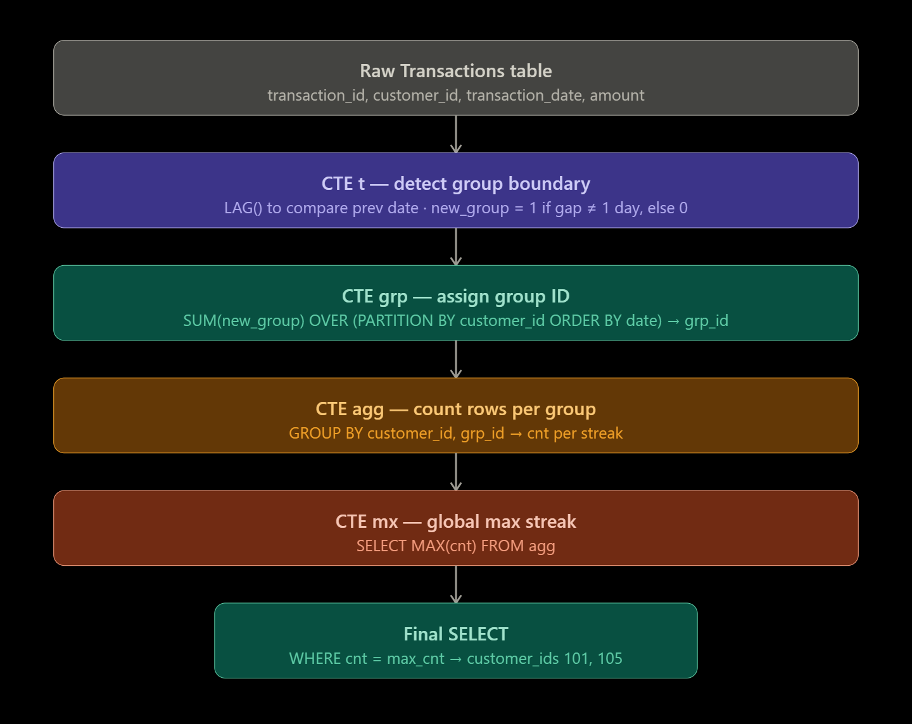

> See also §8 for the **`date − row_number` invariant** that powers the gaps-and-islands trick.

### 3.19 Count occurrences of a character/word in a string
```sql
-- count letter 'a'
SELECT name, LEN(name) - LEN(REPLACE(name, 'a', '')) AS cnt FROM strings;
-- count a multi-char word 'Ak' → divide by its length
SELECT name, (LEN(name) - LEN(REPLACE(name, 'Ak', ''))) / LEN('Ak') AS cnt FROM strings;
-- count spaces (words-1)
SELECT name, LEN(name) - LEN(REPLACE(name, ' ', '')) AS cnt FROM strings;
```

### 3.20 UPDATE variations
```sql
UPDATE emp SET salary = 12000 WHERE emp_id = 1;                          -- with WHERE
UPDATE emp SET salary = 12000, dep_id = 200 WHERE emp_id = 2;            -- multiple cols
UPDATE emp SET salary = salary * 1.1 WHERE emp_id = 4;                   -- derivation
UPDATE emp SET salary = CASE WHEN dep_id = 100 THEN salary*1.1
                             WHEN dep_id = 200 THEN salary*1.2
                             ELSE salary END;                            -- CASE
-- update using a join (MySQL syntax)
ALTER TABLE emp ADD dep_name VARCHAR(20);
UPDATE emp e INNER JOIN dept d ON e.dep_id = d.dep_id SET e.dep_name = d.dep_name;
```
> ⚠️ The notebook also showed the Postgres form (`UPDATE emp SET dep_name = d.dep_name FROM emp e INNER JOIN dept d ...`). Postgres uses `UPDATE … SET … FROM …`; MySQL uses `UPDATE … JOIN … SET …`. Use the dialect that matches your DB.

---

## 4. Functions & Keywords Reference

### 4.1 Stored Functions vs Procedures

| | Procedure | Function |
|---|---|---|
| Definition | Set of statements performing an **action** | Set of statements **returning a single value** |
| Return | No direct return (can use `OUT` params) | Always returns a scalar via `RETURN` |
| Usage in queries | Cannot be used in `SELECT`/`WHERE` | Can be used in `SELECT`/`WHERE` |
| Call | `CALL procedure_name();` | `SELECT function_name();` |
| Parameters | `IN`, `OUT`, `INOUT` | `IN` only |
| Modify data | Can (`INSERT`/`UPDATE`) | Typically read-only |
| Use case | Batch ops, logging | Calculations, aggregates |

```sql
-- FUNCTION (scalar)
DELIMITER //
CREATE FUNCTION getUserIDs(startDate DATE, endDate DATE, minAmount INT)
RETURNS INT
DETERMINISTIC          -- same inputs → same output
READS SQL DATA         -- only reads, doesn't modify
BEGIN
    DECLARE user_cnt INT;
    SELECT COUNT(DISTINCT user_id) INTO user_cnt
    FROM Purchases
    WHERE time_stamp BETWEEN startDate AND endDate AND amount >= minAmount;
    RETURN user_cnt;
END //
DELIMITER ;
SELECT getUserIDs('2022-03-08','2022-03-20',1000) AS user_count;

-- PROCEDURE (returns a result set)
DELIMITER //
CREATE PROCEDURE getUserIDs(IN startDate DATE, IN endDate DATE, IN minAmount INT)
BEGIN
    SELECT DISTINCT user_id FROM Purchases
    WHERE amount >= minAmount AND time_stamp BETWEEN startDate AND endDate
    ORDER BY user_id;
END //
DELIMITER ;
CALL getUserIDs('2022-03-08','2022-03-20',1000);
```

### 4.2 Date & Time Functions
| Function | Meaning |
|---|---|
| `CURRENT_TIMESTAMP()` / `CURRENT_DATE()` / `CURRENT_TIME()` | now / today / time |
| `DATE(col)` / `CAST(col AS DATE)` | strip time → date |
| `DATEDIFF(end, start)` | end − start in days **(see +1 gotcha, §8)** |
| `TIMESTAMPDIFF(unit, start, end)` | difference in unit (minute/day/month…) **(month gotcha, §8)** |
| `DATE_ADD(d, INTERVAL 1 DAY)` / `DATE_SUB(...)` | add / subtract interval |
| `LAST_DAY(d)` | last day of the month |
| `EXTRACT(part FROM col)` | pull day/hour/year etc. |
| `DATE_FORMAT(d, '%m/%Y')` | format date → **string** |
| `STR_TO_DATE(s, '%m/%d/%Y')` | parse string → date |
| `DATE_TRUNC('month', d)` | truncate to start of month |

> `DATE_TRUNC('month', order_date)` ≈ `DATE_FORMAT(order_date, '%Y-%m-01')` — **⚠️ but `DATE_FORMAT` returns a string while `DATE_TRUNC` returns a date/datetime.** Cast if you need a date.
> `DATE_FORMAT` returns a STRING → wrap in `STR_TO_DATE` to get a real date back.

### 4.3 NULL handling: IFNULL / NULLIF / COALESCE
- **`IFNULL(expr, replacement)`** — if `expr` is NULL → replacement, else `expr`. Default values, avoid NULL in calculations.
- **`NULLIF(a, b)`** — returns NULL if `a = b`, else `a`. Classic divide-by-zero guard: `revenue / NULLIF(users, 0)`.
- **`COALESCE(a, b, c, …)`** — first non-NULL argument (n-ary). Used in FULL OUTER joins to merge key columns.

### 4.4 Aggregates & NULLs
| Function | Ignores NULL? | Behaviour |
|---|---|---|
| `SUM(col)` | ✅ Yes | Returns NULL if **all** values are NULL |
| `AVG(col)` | ✅ Yes | numeric only |
| `COUNT(col)` | ✅ Yes | counts only non-null values |
| `COUNT(*)` / `COUNT(1)` / `COUNT('x')` | ❌ No | counts **all** rows incl. NULL |
| `MAX` / `MIN` | ✅ Yes | work on many data types |

> ⚠️ The original note said `COUNT(COL) = COUNT(DISTINCT COL)`. **They both ignore NULL but are not equal** — `COUNT(col)` counts non-null rows; `COUNT(DISTINCT col)` counts distinct non-null values.
> Aggregates return NULL only when the result set is empty or all-NULL. Prefer `SUM(CASE WHEN … THEN 1 ELSE 0 END)` over `COUNT(CASE …)` when conditionally counting (COUNT counts the 0s too if you're not careful).

### 4.5 Numeric: Division, CAST, ROUND
- **Integer division** truncates: `SELECT 10/3;` → `3`.
- One non-integer operand → float: `SELECT 10.0/3;` → `3.3333…`.
- Force precision: `SELECT CAST(10 AS DECIMAL(10,2))/3;` → `3.33`, or `SELECT ROUND(10/3, 2);`.
- **ROUND(number, precision)** — precision maps to powers of ten:

  | precision | rounds to | example |
  |---|---|---|
  | 2 | hundredths | `ROUND(10233.45, 2)` → 10233.45 |
  | 1 | tenths | |
  | 0 | ones (nearest integer) | |
  | -1 | tens | |
  | -3 | thousands | `ROUND(10233.45, -3)` → 10000 |
  | -5 | hundred-thousands (lakhs) | |

### 4.6 Strings
- **`INSTR(string, substring)`** — 1-based position of first occurrence, `0` if not found. `INSTR('Hello World','World')` → 7.
- Non-standard/reserved column names → quote them: `SELECT "tennis player" FROM players;`

### 4.7 Signed vs Unsigned integers
- By default all integer types are **signed**.
- `INT UNSIGNED` stores only ≥ 0.
- ⚠️ **`ROW_NUMBER()` is treated as unsigned**; subtracting it from a signed `INT` (e.g. `capacity - ROW_NUMBER()`) can error because MySQL won't implicitly convert signed↔unsigned when the result could be negative. `CAST` one side.

### 4.8 DELETE vs TRUNCATE
| | DELETE | TRUNCATE |
|---|---|---|
| Scope | rows matching `WHERE` | all rows, no `WHERE` |
| Rollback | ✅ can be rolled back | ❌ generally cannot (DB-dependent) |
| Logging | per-row log → slower | no per-row log → fast |
| Mechanism | locks & removes row by row | drops whole table data at once |

### 4.9 ALTER vs UPDATE
- **ALTER** changes the **column/table structure** (DDL).
- **UPDATE** changes the **row data** (DML).

### 4.10 Foreign Keys / referential actions
```sql
FOREIGN KEY (order_id) REFERENCES orders(order_id) ON DELETE CASCADE
```
- **ON DELETE CASCADE** — deleting parent deletes child rows (child can't exist without parent).
- **ON DELETE SET NULL** — deleting parent sets child FK to NULL (child still makes sense alone).

### 4.11 Creating a table like another / temp result
```sql
CREATE TABLE transaction_test AS SELECT * FROM transactions WHERE 1 = 2;  -- empty copy of structure
```
> ⚠️ `SELECT * INTO transaction_test FROM transactions WHERE 1=2;` errors in MySQL (it's SQL-Server syntax). Use `CREATE TABLE … AS SELECT …`.

---

## 5. Indexing & Query Optimization

### 5.1 How table data is actually stored
The row/column grid is only a **logical** representation. Physically:
- DBMS stores rows in **Data Pages** (typically 8KB / 8192 bytes; varies by DB).
- A page = **Header** (96B: page no, free space, checksum) + **Data Records** + **Offset array** (36B: each slot points to a record). If a row ≈ 64B, one 8KB page holds ~125 rows.

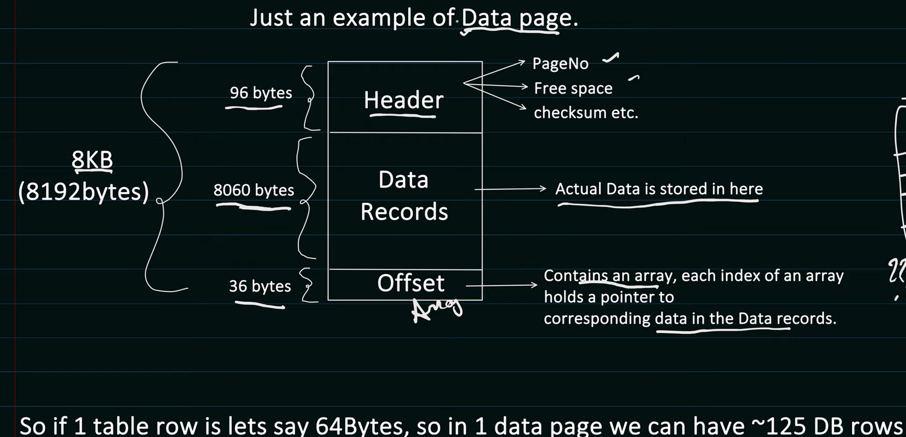
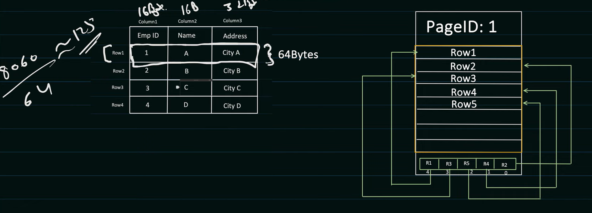

- Pages live in **Data Blocks** on disk — the minimum unit of an I/O read/write (4KB–32KB, commonly 8KB). A block holds one or many pages.
- DBMS controls page placement but has **no control over data blocks** (managed by the storage system). It maintains a page→block mapping.

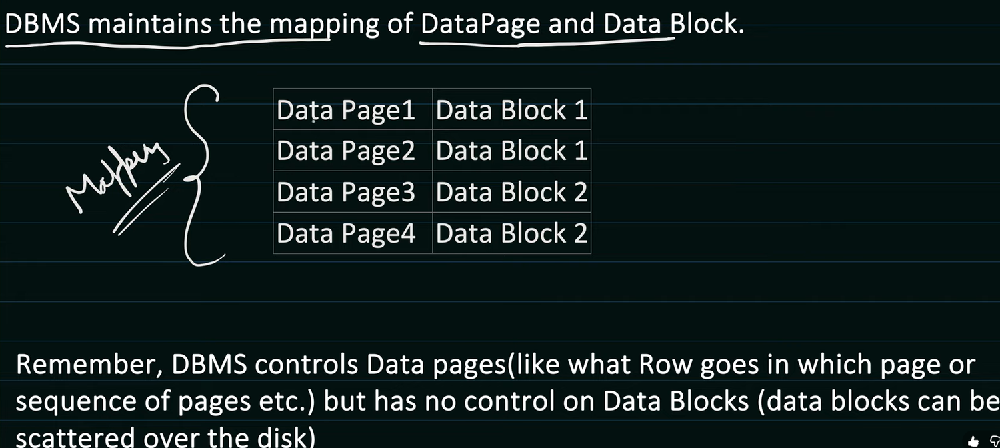

### 5.2 Why index? B-tree / B+ tree
- Without an index, the DBMS scans every row → **O(N)**. With millions of rows that's slow.
- A **B+ Tree** gives **O(log N)** for insert/search/delete.
- **B (Balanced) Tree:** keeps data sorted; all leaves at the same level; an *M-order* tree has at most M children and M−1 keys per node.

Example — store `9, 33, 75, 41, 98, 214, 126, 55, 72` in a 3-order B-tree:

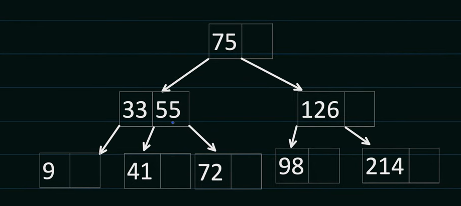

- **B+ Tree** = B-tree **plus leaf nodes linked to each other** (sequential scan friendly). DBMS uses B+ trees to manage data pages & rows.
  - Root/intermediary nodes hold **routing values** (may even reference deleted keys, kept for ordering).
  - **Leaf nodes hold the actual indexed column values** (and pointers to data pages).

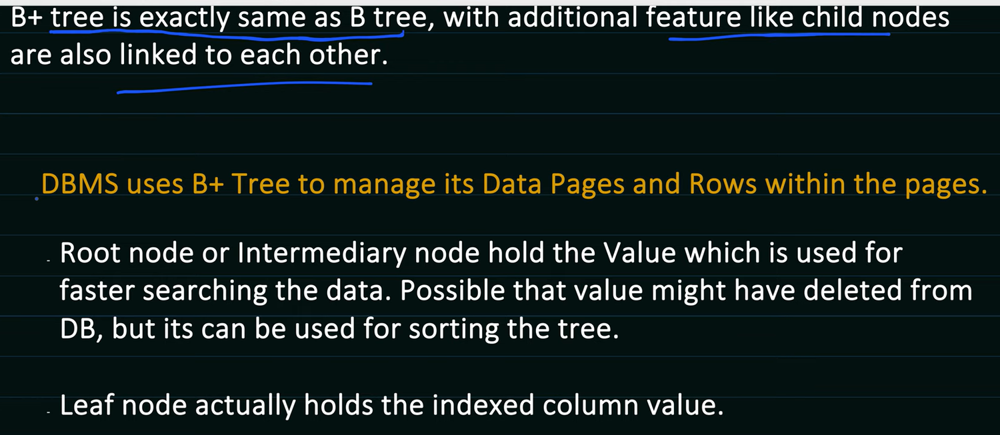
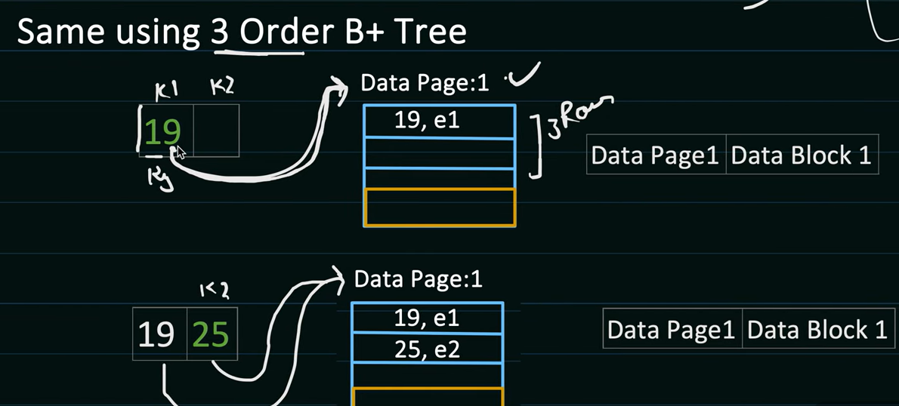

### 5.3 Sparse vs Dense indexing
- **Sparse** — index entry for *some* rows (per interval/key). MySQL **B-tree indexes (InnoDB/MyISAM default) are sparse** — they store pointers to data pages, not every row.
- **Dense** — an index entry for **every** row (e.g. InnoDB clustered PRIMARY KEY).

### 5.4 Clustered vs Non-clustered
- **Clustered index** — the physical **order of rows in the data pages matches the index order**. Only **one per table** (you can only sort the pages one way).
  - If you don't specify one, the DBMS uses the **PRIMARY KEY** (UNIQUE + NOT NULL).
  - If no PK exists, it creates a **hidden sequential column** as the clustering key.
- **Non-clustered index** — a **separate structure** that references the base table; multiple allowed per table; lookups are relatively slower than clustered.

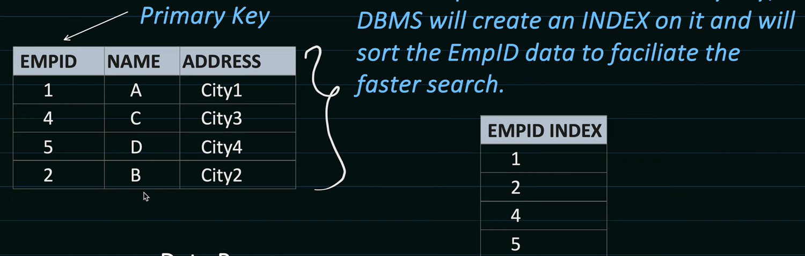
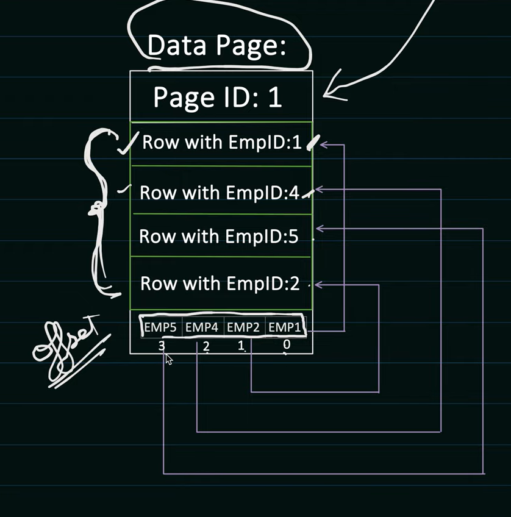

| | Clustered | Non-clustered |
|---|---|---|
| Storage | reorders the table itself | separate entity referencing the table |
| Speed | faster retrieval | relatively slower |
| Count per table | exactly 1 | many |

> Index overhead: index pages are stored in blocks too; many secondary indexes = lots of write overhead and page-splitting cost.

### 5.5 Index DDL
```sql
CREATE INDEX idx_name ON table_name(column_name);
SHOW INDEX FROM table_name;
DROP INDEX idx_name ON table_name;
```

### 5.6 SARGable vs Non-SARGable
**SARGable** = *Search ARGument able* → the query can use an index.
```sql
-- ✅ SARGable
SELECT * FROM users    WHERE age = 25;
SELECT * FROM customers WHERE country IN ('USA','India');
SELECT * FROM orders   WHERE order_date >= '2024-01-01';

-- ❌ Non-SARGable (function on the indexed column → can't seek the index)
SELECT * FROM orders WHERE YEAR(order_date) >= 2024;
SELECT * FROM users  WHERE UPPER(name) = 'A';
```
> ⚠️ The notebook had a typo `yea(order_date)` — it should be `YEAR(order_date)`.

How to make queries SARGable:
- Don't wrap the indexed column in a function/calculation in `WHERE`.
- Use direct comparisons; convert function predicates into **ranges**.
- If a function is unavoidable, use a **computed column** or **function-based index**.

```sql
-- Non-SARGable
SELECT * FROM transactions
WHERE DATE(transaction_time) = '2025-01-01' AND amount + tax > 500;

-- SARGable fix: precompute + index + range
ALTER TABLE transactions ADD COLUMN total_amount DECIMAL(10,2);
UPDATE transactions SET total_amount = amount + tax;
CREATE INDEX idx_total_amount ON transactions(total_amount);
SELECT * FROM transactions
WHERE transaction_time >= '2025-01-01' AND transaction_time < '2025-01-02'
  AND total_amount > 500;
```

### 5.7 Date filtering: range, not function
```sql
-- ❌ Non-SARGable
WHERE YEAR(o.order_date) = 2020 AND MONTH(o.order_date) = 2
-- ✅ SARGable range
WHERE o.order_date >= '2020-02-01' AND o.order_date < '2020-03-01'
```
- Use `< '2020-03-01'` (not `<= '2020-02-29'`) so datetime values late on the last day aren't excluded.
- Dynamic/professional version:
  ```sql
  -- MySQL
  WHERE o.order_date >= '2020-02-01' AND o.order_date < DATE_ADD('2020-02-01', INTERVAL 1 MONTH)
  -- Postgres
  WHERE o.order_date >= DATE '2020-02-01' AND o.order_date < DATE '2020-02-01' + INTERVAL '1 month'
  ```
- Function-based filtering → Index **Scan** + filter, high I/O. Range filtering → Index **Seek**, minimal I/O, stops early.

> "Filter Orders in a CTE first to speed it up?" → usually **no**; optimizers inline CTEs, plan is often identical.

### 5.8 Views & Materialized Views
- A **view** is a virtual table over a query's result set — simplifies complex queries, adds a security layer, presents data in a specific shape. Always shows up-to-date data (recreated each query).
```sql
CREATE VIEW view1 AS SELECT rollno, name FROM student;
SELECT * FROM view1;
```
- **Materialized view** stores the data physically (precomputed); must be refreshed.
```sql
CREATE MATERIALIZED VIEW mvw_orders AS
SELECT o.*, r.return_date FROM orders o LEFT JOIN returns r ON o.order_id = r.order_id;
REFRESH MATERIALIZED VIEW mvw_orders;          -- Postgres
-- CREATE ... WITH NO DATA  → defines structure without populating
```

| Feature | Normal View | Materialized View |
|---|---|---|
| Storage | not physical | physical |
| Freshness | always up-to-date | can be stale; needs refresh |
| Performance | slower (depends on base) | faster reads (precomputed) |
| Refresh | none | manual/automatic |

---

## 6. DBMS Theory

### 6.1 DBMS vs RDBMS
- **DBMS** — software to create & maintain a database; an interface for CRUD; stores data more compactly/securely than a file-based system. (e.g. XML, Windows Registry as primitive examples.)
- **RDBMS** — stores data as **tables** (MySQL, OracleDB). Solves traditional-DB problems: lack of indexing, data inconsistency/redundancy, no concurrency control.

### 6.2 SQL command families (DDL / DML / DCL / TCL)
- **DDL** (define): `CREATE, ALTER, DROP, TRUNCATE, RENAME`.
- **DML** (manipulate): `SELECT, INSERT, UPDATE, DELETE`.
- **DCL** (permissions): `GRANT, REVOKE`.
- **TCL** (transactions): `COMMIT, ROLLBACK, SAVEPOINT`.

### 6.3 ACID
- **Atomicity** — all or nothing; the whole transaction commits or none of it does.
- **Consistency** — preserves database invariants (valid state → valid state).
- **Isolation** — concurrent transactions are isolated from each other.
- **Durability** — once committed, data persists even after a system failure (often via replication).

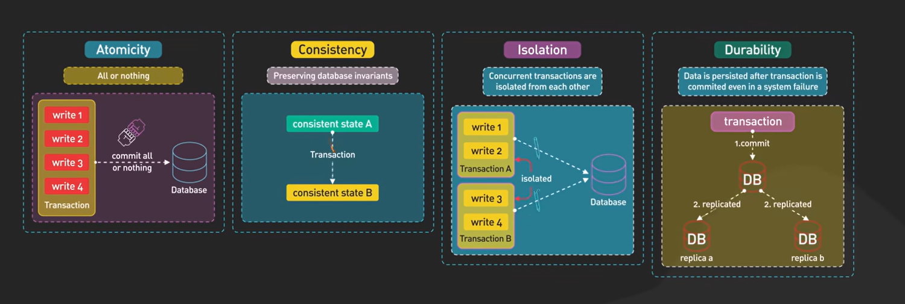

### 6.4 Architecture & data abstraction
- **2-tier** — client app talks **directly** to the DB server (no middleware). E.g. MS-Access contact manager.
- **3-tier** — adds a middle application layer between client & DB (GUI, security, accessibility). E.g. a registration form / large website.

Three levels of abstraction:
- **Physical level** — lowest; storage details; hidden from users (managed by DBMS).
- **Logical/Conceptual level** — what data is stored + relationships (devs/admins work here).
- **External/View level** — exposes only part of the DB; hides schema/storage. A query result / view is an example.

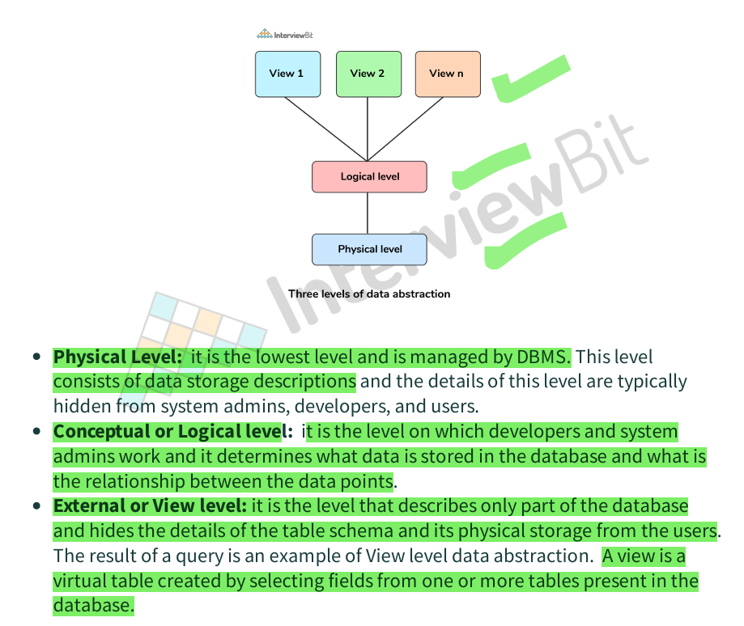

### 6.5 ER Model
An **entity-relationship model** is a diagrammatic DB-design approach: real-world objects → **entities**, with **relationships** between them.

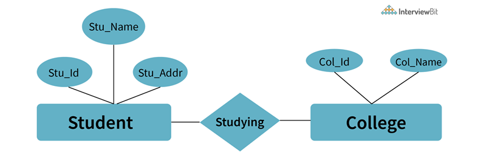
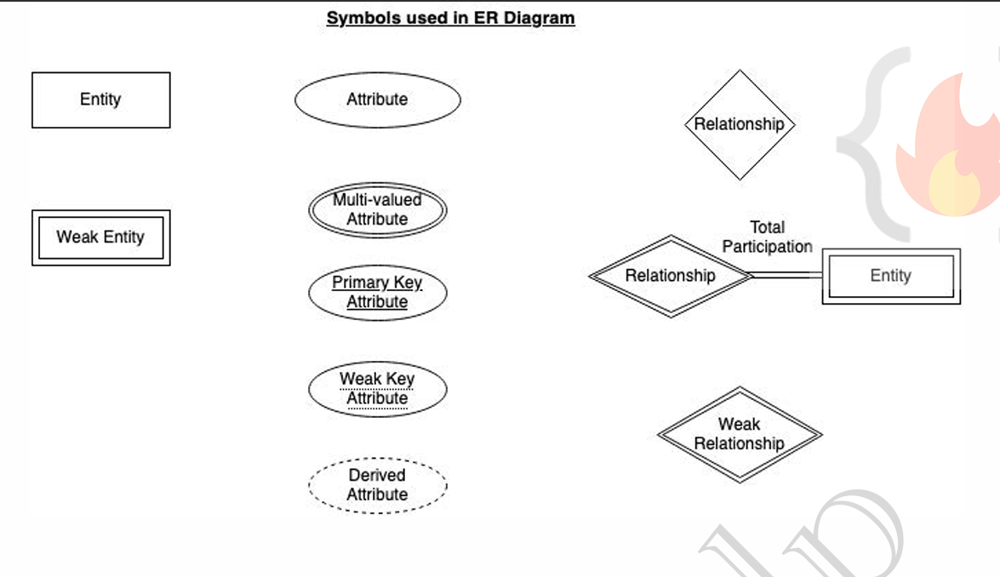

**Attribute types:** Simple (atomic, can't divide) · Composite (name→first/middle/last) · Single-valued (student ID) · Multi-valued (phone numbers) · Derived (computed from others).

**Relationship cardinality:** 1:1 (person↔passport) · 1:N (customer→accounts) · M:N (customer↔product).

**Specialisation vs Generalisation (EER):**
- **Specialisation** — split an entity into sub-entities (Top-Down). Person → customer/student/employee. "is-a" relationship; shown by a triangle.
- **Generalisation** — combine overlapping entities into a superclass (Bottom-Up). Car/Jeep/Bus → Vehicle. Reduces repetition, simplifies the DB.

### 6.6 Relational Model terminology
- **Tuple** — a single row (one record).
- **Column/Attribute** — has a permitted set of values = its **domain**.
- **Degree** — number of attributes/columns.
- **Cardinality** — number of tuples/rows.
- **Relational Key** — set of attributes uniquely identifying each tuple.

### 6.7 Keys (7 types)
- **Super Key** — any set of attributes that uniquely identifies a tuple (the superset).
- **Candidate Key** — minimal super keys; a table may have several (e.g. studentId, firstName).
- **Primary Key** — the chosen candidate key; UNIQUE **and** NOT NULL.
- **Alternate Key** — candidate keys not chosen as primary.
- **Unique Key** — like PK but **allows NULLs**.
- **Foreign Key** — attribute taking values from a PK in another table (referential integrity).
- **Composite Key** — combination of 2+ columns that uniquely identifies a tuple.

`Super Key ⊇ Candidate Key ⊇ Primary Key`

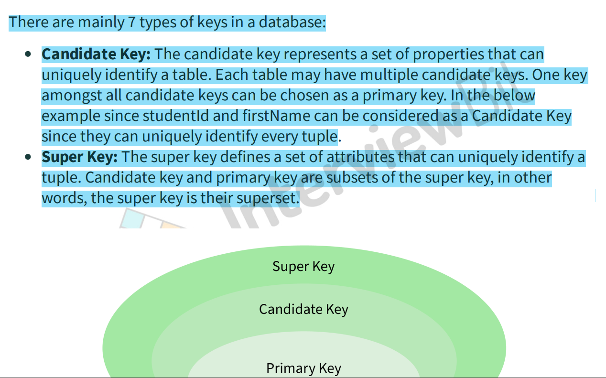
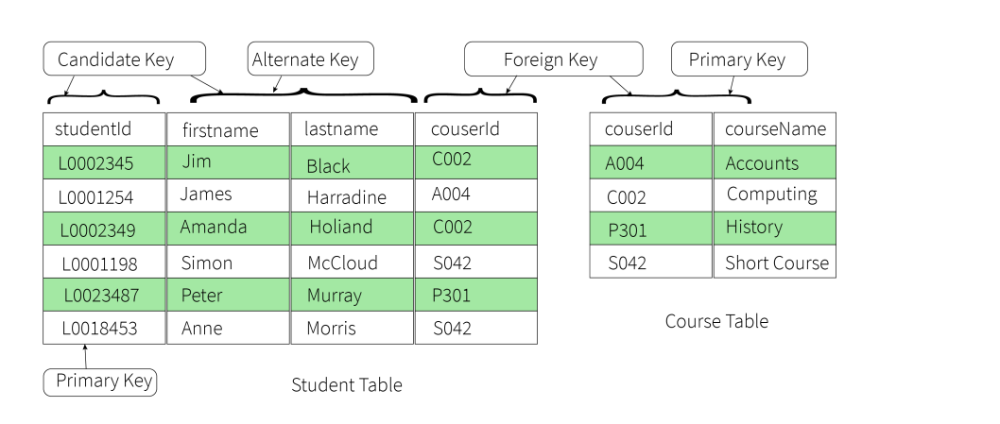

### 6.8 Key constraints (6)
`NOT NULL` · `UNIQUE` · `DEFAULT` · `CHECK` · `PRIMARY KEY` · `FOREIGN KEY`.
```sql
CREATE TABLE Employees (
    EmployeeID   INT AUTO_INCREMENT PRIMARY KEY,
    Name         VARCHAR(100) NOT NULL,
    Email        VARCHAR(100) UNIQUE,
    Phone        VARCHAR(15)  UNIQUE,
    Age          INT      CHECK (Age >= 18 AND Age < 65),
    Salary       DECIMAL(10,2) CHECK (Salary > 0),
    DepartmentID INT,
    status       ENUM('Active','Inactive','Resigned') NOT NULL DEFAULT 'Active',
    CreatedAt    TIMESTAMP DEFAULT CURRENT_TIMESTAMP,
    FOREIGN KEY (DepartmentID) REFERENCES Departments(DepartmentID) ON DELETE SET NULL
);
```
> **AUTO_INCREMENT** generates a unique sequential integer (usually the PK); it increases each insert and **does not reuse deleted values**.

### 6.9 Normalization
Process of organizing schema to store **non-redundant, consistent** data. Removes anomalies: **Insertion, Update, Deletion**. Splits larger tables into smaller ones linked by relationships.

Normal forms: **1NF → 2NF → 3NF → BCNF**.

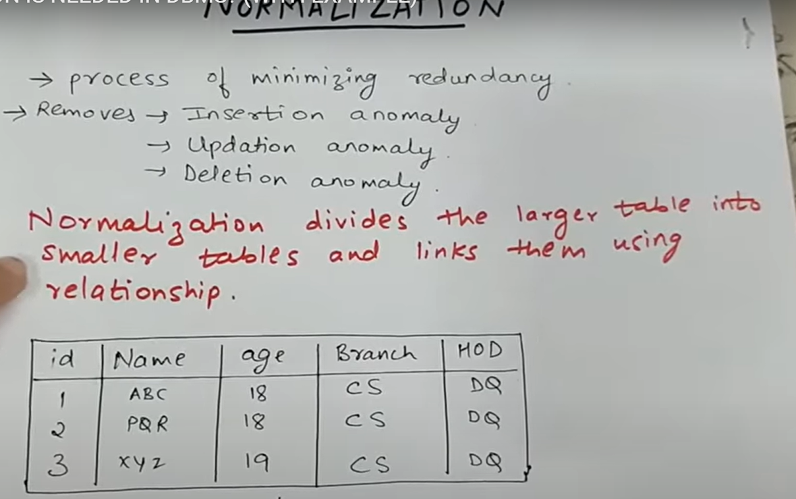

- **1NF** — atomic (single-valued) attributes; fixed attribute domain; unique column names; order doesn't matter (no repeating groups).

  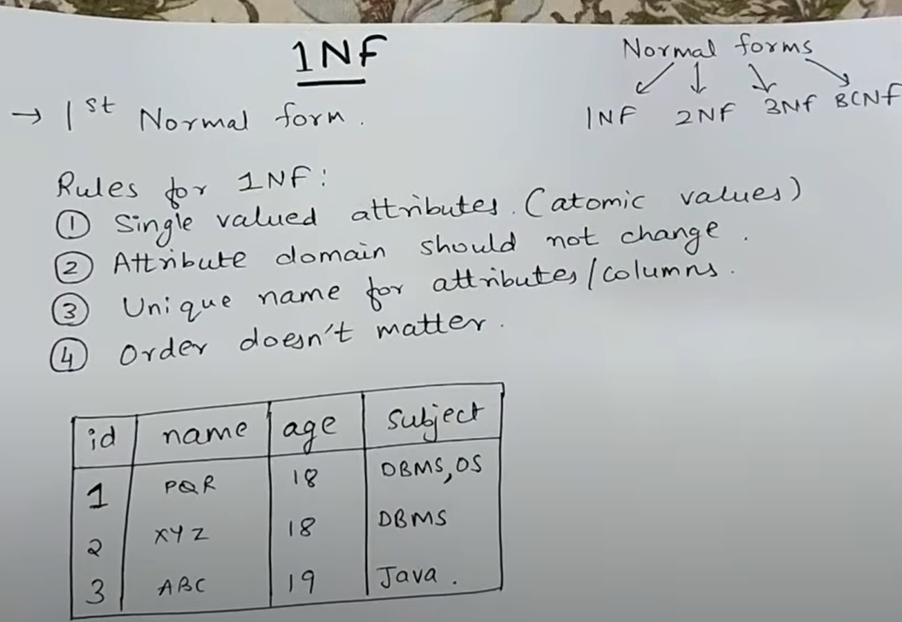

- **2NF** — in 1NF **and no partial dependency** (no non-key attribute depends on *part* of a composite primary key). Partial dependency arises when there are 2+ candidate/primary keys.

  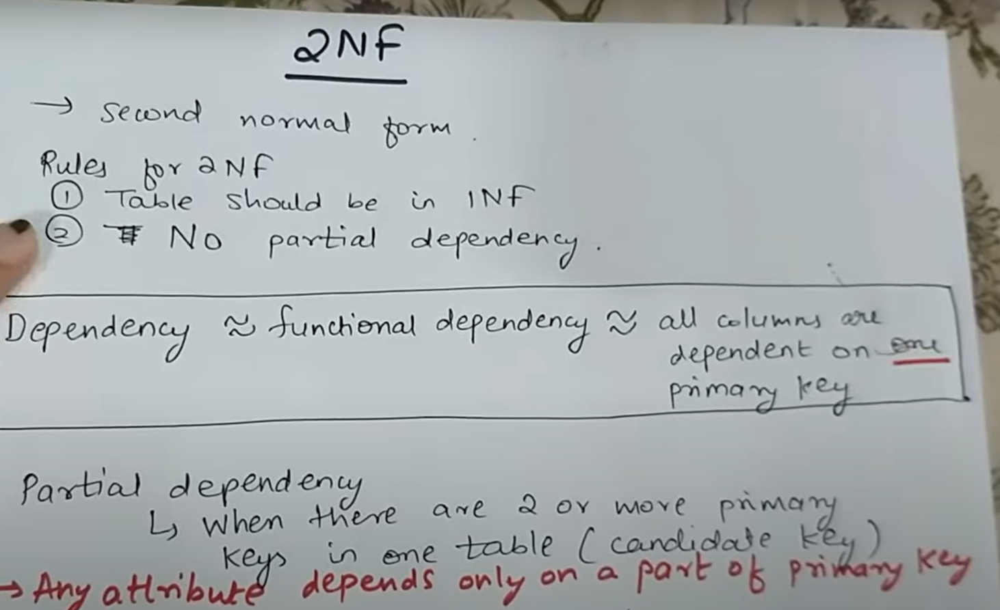

- **3NF** — in 2NF **and no transitive dependency** (a non-prime column must not depend on another non-prime column; `non-prime → non-prime` is disallowed). Non-PK columns may hold NULLs.

  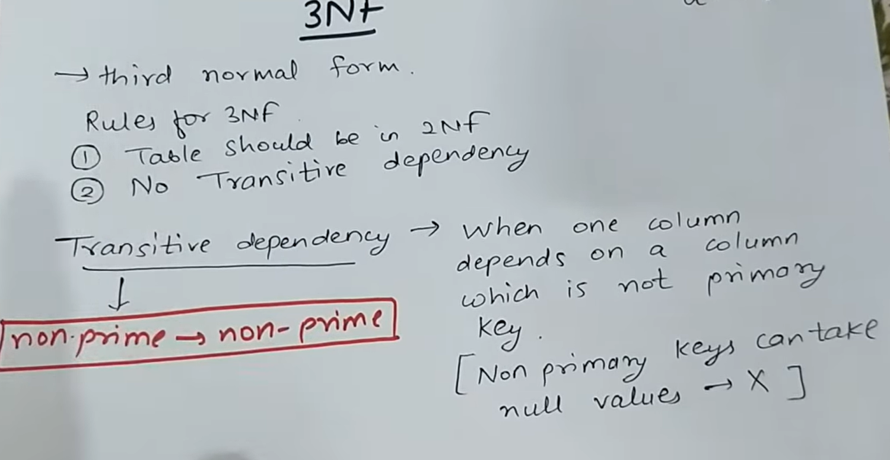

- **BCNF (3.5NF)** — in 3NF, and for **every** functional dependency A → B, **A must be a super key**. A non-prime attribute can't determine a prime attribute.

### 6.10 Normalization vs Denormalization
| | Normalization | Denormalization |
|---|---|---|
| Goal | reduce redundancy & inconsistency | faster query execution |
| Method | split into a set of schemas | combine/duplicate data |
| Used in | **OLTP** (fast inserts/updates, quality data) | **OLAP** (fast search/analysis) |
| Data integrity | maintained | may not retain |
| Redundancy | eliminated | added |
| # tables | increases | decreases |
| Disk space | optimized | wastage |

### 6.11 OLTP vs OLAP
| OLTP | OLAP |
|---|---|
| Online Transaction Processing | Online Analytical Processing |
| Transaction-oriented, high concurrency | Low transaction frequency, complex queries |
| Simple queries, fast response, few records | Heavy aggregations, response-time sensitive |
| Backend to applications, frequent writes | Feeds BI/visualization, fast reads |
| **Row-based** storage | **Columnar** storage |
| Decentralized (avoids single point of failure) | Multi-dimensional schemas, data mining |

> **Data warehousing** = collecting, extracting, transforming, and loading data from multiple sources into one database.

### 6.12 Triggers & Cursors
- **Trigger** — a DB object that **fires automatically** on DML/DDL events; used for integrity, enforcing business rules, auditing, replication. Oracle also supports schema-level triggers (After Creation, Before/After Alter/Drop…).
```sql
CREATE TRIGGER before_employee_update
BEFORE UPDATE ON employees
FOR EACH ROW
BEGIN
    INSERT INTO employee_logs (employee_id, old_name, new_name, changed_at)
    VALUES (OLD.id, OLD.name, NEW.name, NOW());
END;
```
- **Cursor** — a DB object to traverse rows **one by one** (retrieve/add/delete). Reduces network traffic but **hurts SQL performance** → best used inside stored procedures. When a query returns a set of rows, they're processed via cursors. Lifecycle: **DECLARE → OPEN → FETCH → CLOSE → DEALLOCATE**. `OPEN` positions just before the first row; `FETCH` pulls a row; closed cursors can be reopened.
```sql
DECLARE
    c_id   customers.id%TYPE;
    c_name customers.name%TYPE;
    CURSOR c1 IS SELECT id, name FROM customers;
BEGIN
    OPEN c1;
    LOOP
        FETCH c1 INTO c_id, c_name;
        EXIT WHEN c1%NOTFOUND;
        DBMS_OUTPUT.PUT_LINE(c_id || ' ' || c_name);
    END LOOP;
    CLOSE c1;
END;
```

---

## 7. Advanced / DB System Design

> These notes follow a "scale a Cab-Booking app" narrative — the standard database-scaling-patterns progression.

### 7.1 Intension vs Extension
- **Intension** — the DB **schema** (description), set at design time, mostly unchanged.
- **Extension** — the number of tuples at a point in time (a **snapshot**); changes constantly as rows are created/updated/deleted.

### 7.2 The scaling journey (Database Scaling Patterns)


1. **Start:** tiny startup, single small DB machine, ~1 booking / 5 min.
2. **Problem:** ~30 bookings/min → poor latency, deadlocks, starvation, failures.
3. **Query optimization & connection pooling** — cache frequently-read non-dynamic data (booking history, profiles) in the app; introduce redundancy/**denormalization** (maybe NoSQL); use a **connection pool** so many app threads share cached DB connections.

   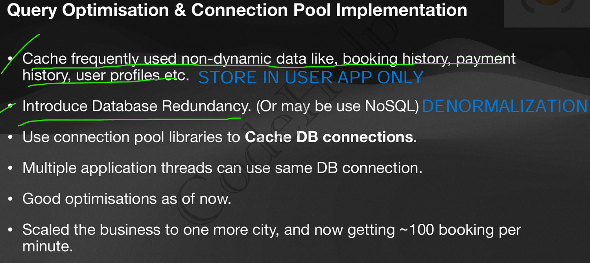

4. **Vertical Scaling (scale-up)** — bigger machine (2× RAM, 3× SSD). Pocket-friendly only to a point; cost grows exponentially.
5. **CQRS (Command Query Responsibility Segregation)** — split reads/writes physically: add replica machines, **all reads → replicas, all writes → primary**. Limit: primary can't handle all writes; primary↔replica lag hurts UX.

   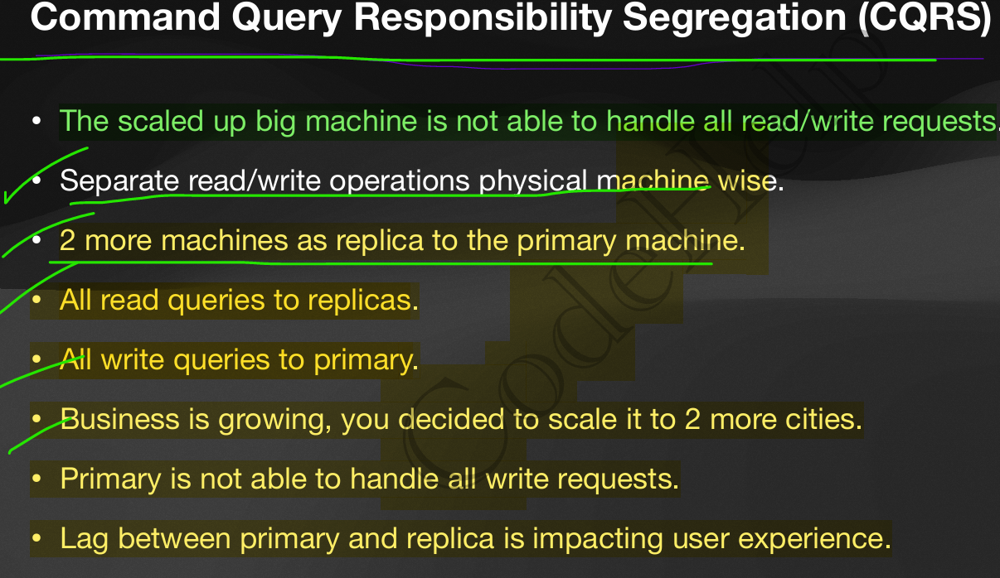

6. **Multi-Primary Replication** — all nodes act as primary & replica in a logical ring; write to any node, read from the fastest responder.
7. **Partitioning by Functionality** — put different functional tables (e.g. location) in separate DB schemas/machines; the app layer joins results.
8. **Horizontal Scaling (scale-out) / Sharding** — many shards, each machine holds part of the data with the same schema; data locality matters; each shard can have replicas. Hard to apply but scales across continents.

   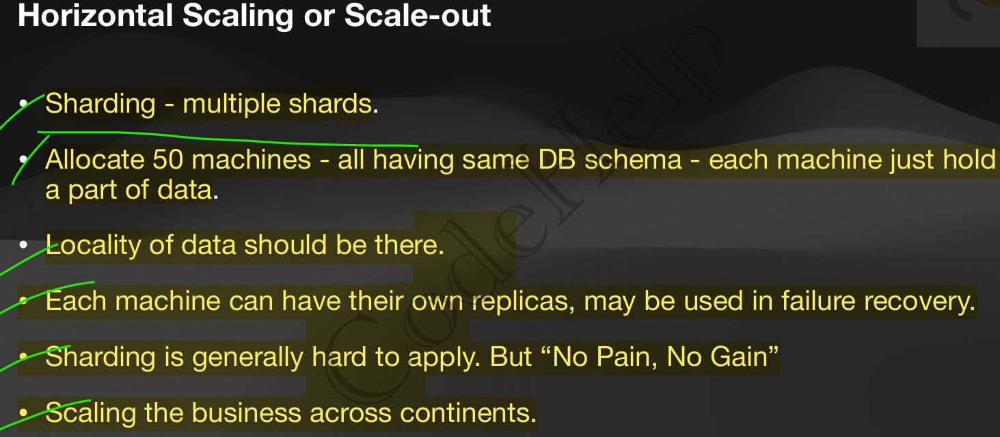

### 7.3 Partitioning
Divides DB objects across servers → better performance & manageability.
- **Vertical Partitioning** — slice column-wise; may need multiple servers to reconstruct a full tuple.
- **Horizontal Partitioning** — slice row-wise; independent row-chunks on different servers.
- **Applied when** the data/requests on a single server are too large and response time degrades.
- **Advantages:** Parallelism, Availability, Performance, Manageability, lower cost than vertical scaling.

### 7.4 Sharding
Technique to implement **horizontal partitioning**: instead of all data on one instance, split it and add a **routing layer** to forward each request to the shard holding the data.
- **Pros:** scalability, availability.
- **Cons:** complexity (partition mapping, routing layer), non-uniformity → re-sharding; poor for analytics (data spread out → scatter-gather problem).

### 7.5 Clustering / Replica-sets
Combining multiple servers/instances behind one database.
- **Data redundancy** — same data on multiple servers (required, kept in sync) → survives a server failure.
- **Load balancing** — distributes workload across cluster nodes → supports more users and traffic spikes.
- **High availability** — more uptime via load balancing + spare machines.

### 7.6 Master–Slave (Master-Replica)
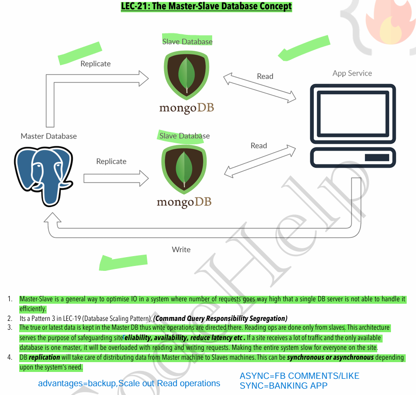

- Writes → **Master** (source of truth); reads → **Slaves**. A form of CQRS.
- Replication distributes data Master→Slaves, **synchronous or asynchronous**:
  - **ASYNC** — e.g. FB comments/likes (eventual consistency OK).
  - **SYNC** — e.g. banking app (must be consistent).
- Benefits: backup, scale-out reads, reliability, lower latency.

### 7.7 CAP Theorem
In a distributed system you can guarantee at most two of:
- **Consistency** — every node sees the same data; a read returns the most recent write.
- **Availability** — every request gets a response, even if some nodes are down (no guarantee it's the latest write).
- **Partition Tolerance** — system keeps working despite dropped/delayed messages between nodes (requires replicating records across nodes).

### 7.8 NoSQL
**Why NoSQL?**
- **Flexible schema** — RDBMS needs a predefined schema; changing it on the fly is hard. Helpful when you don't have all data upfront.
- **Horizontal scaling** — collections are self-contained (not relationally coupled), so they distribute across nodes without cross-node joins; achieved via **sharding / replica-sets**.
- **High availability** — auto-replication; if a server fails, read from another.
- **Fast reads** — *"data that is accessed together is stored together"* → typically no joins. But **updates/deletes are harder**.
- Good for **caching** and **cloud** applications.

**Types of NoSQL data models:**
1. **Key-Value** — simplest; attribute(key)→value. Use: shopping carts, sessions, preferences. e.g. DynamoDB, Redis, Oracle NoSQL. Great for constant-time lookups & caching.
2. **Column-Oriented (Wide-Column / C-Store)** — store column values together → efficient compression & analytics on few columns. Use: analytics. e.g. Cassandra, Redshift, Snowflake.
3. **Document-Based** — JSON-like documents of field/value pairs (strings, numbers, arrays, objects). Supports ACID → suitable for transactions. Use: e-commerce, trading, mobile apps. e.g. MongoDB, CouchDB.
4. **Graph-Based** — focuses on **relationships**; elements are nodes, connections are first-class links stored directly. Optimised for traversing relationships (vs expensive SQL joins). Usually run alongside traditional DBs.

---

## 8. SQL Nuggets & Gotchas

- **Window functions run on the post-`GROUP BY` result** — like a temporary view over the grouped set.
- **Week of month:** `WEEK(purchase_date) - WEEK('2023-11-01') + 1`.
- **Leap year:** `(start_year % 4 = 0 AND start_year % 100 != 0) OR (start_year % 400 = 0)`.
- **`DATEDIFF` is off by one:** `DATEDIFF(end, start)` excludes one day. `DATEDIFF('2020-01-02','2020-01-01') = 1` but the actual span is 2 days → use `DATEDIFF(...) + 1` when counting inclusive days.
- **`NOT IN` + NULL trap:** if the `NOT IN` list contains **even one NULL**, the comparison becomes `UNKNOWN` and the condition is **never TRUE** → query returns nothing. Prefer `NOT EXISTS` / `LEFT JOIN … IS NULL`.
- **`TIMESTAMPDIFF(MONTH, …)` counts *completed* months, not calendar-month changes:** `TIMESTAMPDIFF(MONTH,'2021-12-31','2022-01-01') = 0`. Fixes:
  - Calendar-month diff: `(YEAR(b)-YEAR(a))*12 + (MONTH(b)-MONTH(a))`.
  - Normalize to month start: `TIMESTAMPDIFF(MONTH, DATE_FORMAT(a,'%Y-%m-01'), DATE_FORMAT(b,'%Y-%m-01'))`.
  - If you truly want *full* months, `0` is correct.
- **NULL division:** always ask "what if there's a NULL/zero in the denominator?" → guard with `NULLIF(denom, 0)`.
- **Percentiles / top 5%:** for a group of size N, `k = 0.05 × N` rows (rounded up, since rows are discrete) is the minimum needed to cover 5%.
- **Persist a LEFT JOIN's non-matching rows across further joins:** keep using `LEFT JOIN` in subsequent joins, otherwise an inner join downstream silently drops them.
- **Tie-breaking:** when multiple rows share the max sort value but you want exactly one, add a secondary sort key (or a row-number filter).
- **`SUM(CASE WHEN …)` over `COUNT(CASE WHEN …)`** when conditionally counting — COUNT counts the non-NULL `0`/`else` results too.
- **Use sum(case when) instead of count where possible.**
- **All possible pairs → use a JOIN**, not LAG/LEAD.
- **Aggregation vs ordering:**
  - Aggregation (`MAX/SUM`) defines **truth** — independent of row order, duplicates, planner. `SUM(30, NULL, NULL) = 30` (NULLs skipped, not added).
  - `ORDER BY … LIMIT 1` just picks the row that *appears* first — misleading with ties, extra columns, or join duplication.
  - **Aggregate first → filter rows → order last.**

### 8.1 Gaps-and-islands: the `date − row_number` invariant
For consecutive dates, `date − ROW_NUMBER()` is **constant** within a streak, so it works as a grouping key:

| date | rn | date − rn |
|---|---|---|
| Jan 1 | 1 | Dec 31 |
| Jan 2 | 2 | Dec 31 |
| Jan 3 | 3 | Dec 31 |

Both increase by 1 each consecutive day, so they cancel: `(d+1) − (r+1) = d − r`.
**Addition is the opposite** — `date + rn` grows by 2 each row (`(d+1)+(r+1) = d+r+2`), so it changes every row and can't group.
> Core intuition: **subtraction cancels equal growth → same key; addition amplifies it.** Understand it, don't memorize.

### 8.2 CTE & Recursive CTE rules
- CTEs execute **top → bottom**. A CTE can reference **itself** (only if recursive) and **earlier** CTEs, but **never a later** one (no forward reference).
- If **any** CTE is recursive, the whole block needs `WITH RECURSIVE` (applies to the entire `WITH`, not one CTE).
- A CTE is recursive when it references itself:
  ```sql
  WITH RECURSIVE cte AS (
      SELECT ...            -- base case
      UNION ALL
      SELECT ... FROM cte   -- self-reference
  )
  ```
- Common errors: missing `RECURSIVE` ("table doesn't exist"); forward reference (cte1 referencing cte2 defined later); wrong CTE name in `FROM`.
- Mental model = variables: `a = 10; b = a + 5;` works, but using `b` before defining it doesn't.
- **`ORDER BY` can only appear at the very end when `UNION` is used** (not inside each branch).

---

## 9. Appendix: Corrections & Diagram Index

### 9.1 Corrections made (flagged inline with ⚠️)
| # | Location | Original | Correction |
|---|---|---|---|
| 1 | §5.6 SARGable | `yea(order_date)` | `YEAR(order_date)` (typo) |
| 2 | §4.4 Aggregates | "`COUNT(col) = COUNT(DISTINCT col)`" | Both ignore NULL but are **not equal** — non-null rows vs distinct non-null values |
| 3 | §4.2 Date funcs | "`DATE_TRUNC = DATE_FORMAT('%Y-%m-01')`" | Equivalent value, but `DATE_FORMAT` returns a **string**, `DATE_TRUNC` a date/datetime |
| 4 | §3.20 / §4.11 | Postgres `UPDATE … SET … FROM …` / `SELECT … INTO` shown for MySQL | Use MySQL `UPDATE … JOIN … SET …` and `CREATE TABLE … AS SELECT …` |
| 5 | §3.17 | 3-table FULL OUTER joined on `u.product_id = i.product_id` | 2nd join key must be `COALESCE(u.product_id, e.product_id)` to keep Europe-only rows |

### 9.2 Diagram index (embedded from `assets/`)
| File | Topic |
|---|---|
| join-types-venn.png | JOIN types as Venn diagrams |
| islands-pattern-flow.png | Gaps-and-islands query flow |
| data-page-structure.png · data-page-rows-offset.png · datapage-datablock-mapping.png | Physical storage: pages/blocks |
| btree-final.png · bplus-tree-explained.png · bplus-tree-datapages.png | B-tree / B+ tree |
| clustered-index-sort.png · clustered-index-datapage.png | Clustered indexing |
| acid-properties.png | ACID |
| data-abstraction-levels.png | 3 levels of abstraction |
| er-diagram-student-college.png · er-diagram-symbols.png | ER model & symbols |
| keys-super-candidate-primary.png · keys-student-course-tables.png | Keys |
| normalization-handwritten.png · normalization-1nf/2nf/3nf.png | Normalization 1NF–3NF |
| db-scaling-patterns.png · query-opt-connection-pool.png · cqrs-readwrite-split.png · horizontal-scaling-sharding.png · master-slave-replication.png | DB scaling & system design |

### 9.3 Source page → section map
| OneNote page | Mapped to |
|---|---|
| 1 — Mysql interview q (COMMON TYPE) | §1.2, §1.3, §1.4 |
| 2 — SQL Coding question | §3 (most), §1.5, §2.3 |
| 3 — MYSQL Theory | §1.1, §2, §3.15–3.17, §4.1, §4.5, §5.8 |
| 4 — IMP FUNCTIONS & KEYWORDS | §2.3, §4 |
| 5 — SQL COMPLEX PATTERN | §1.5, §3.4, §8 |
| 6 — Indexing | §5.1–5.5 |
| 7 — ADVANCED DBMS | §7 |
| 8 — DBMS | §6 |
| 9 — SQL NUGGETS | §8 |
| 10 — SQL OPTIMISATIONS | §5.6 |

*Plain-text OCR of all 228 images is archived at `%TEMP%\sql_ocr.txt`; full-resolution source PNGs at `%TEMP%\onenote_sql_img\` (not committed).*
